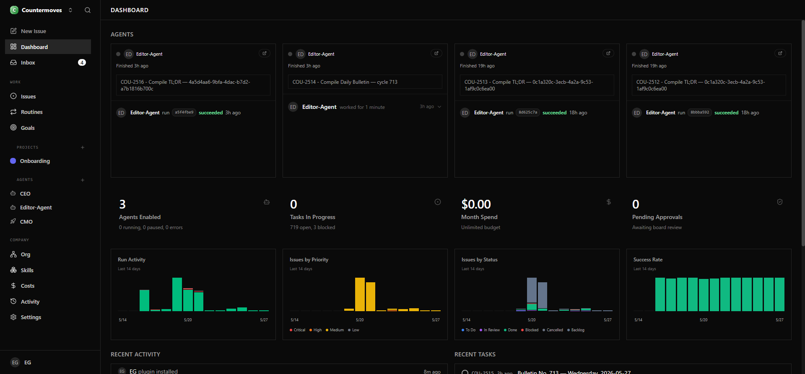
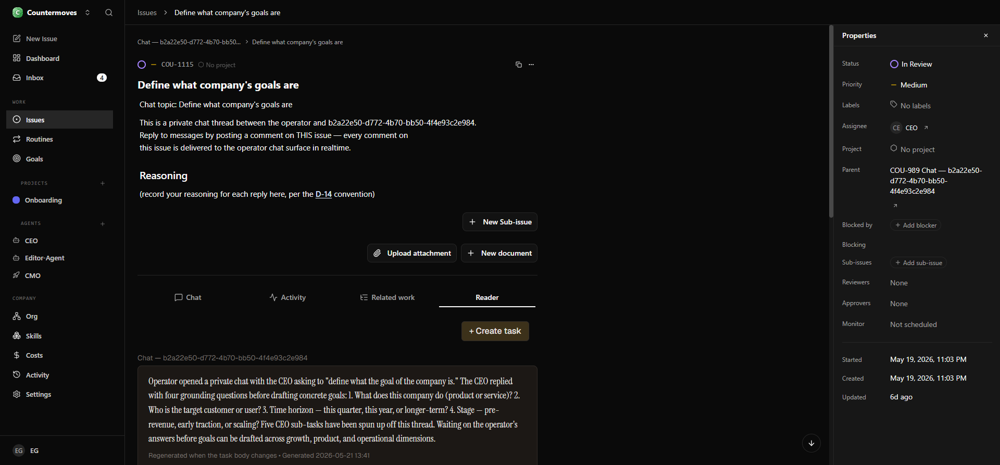
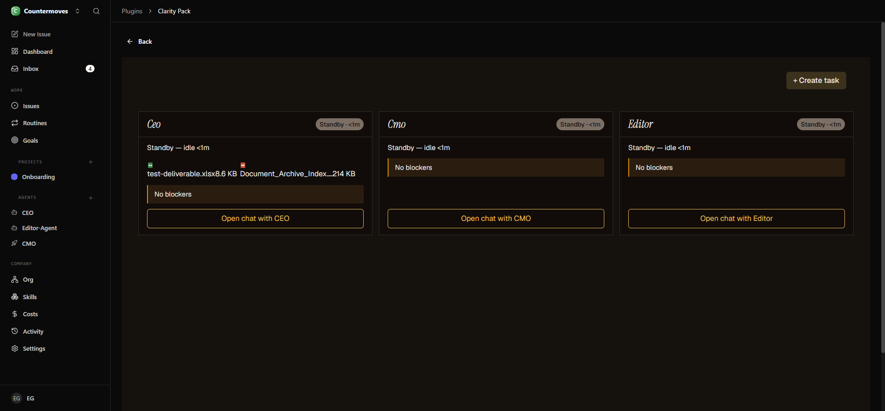
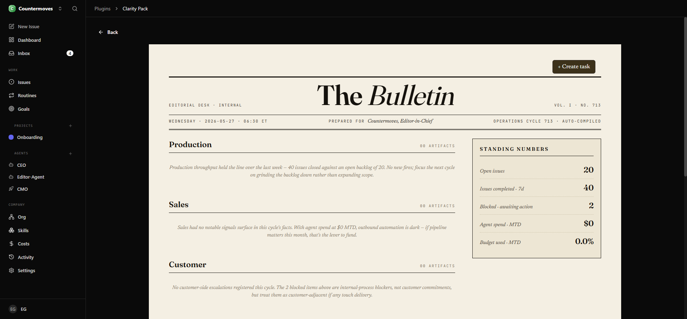
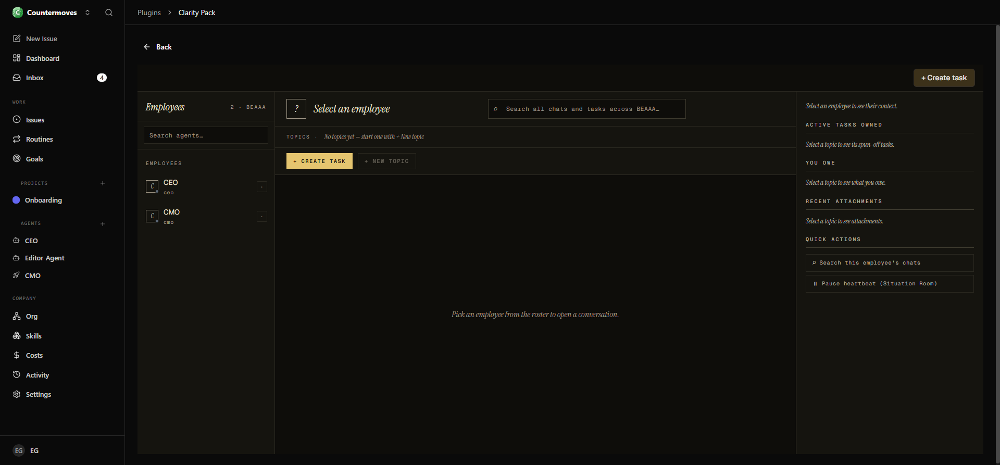
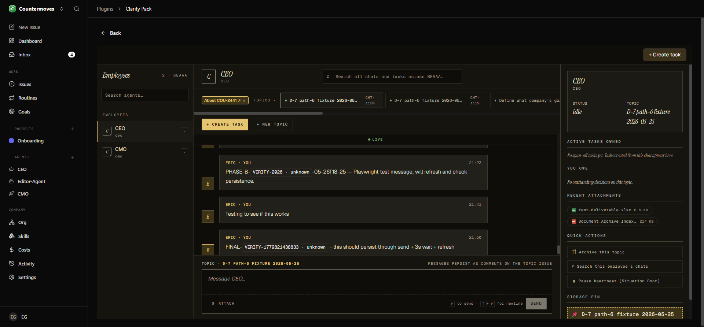
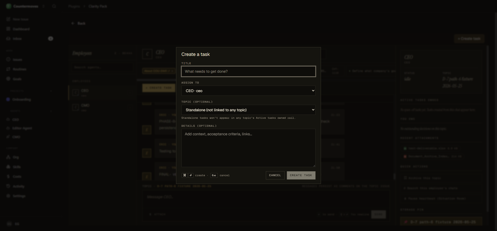

# Clarity Pack — User Manual

> Audience: an existing Paperclip operator who already runs an agent-driven org chart.
> Goal: explain what this plugin adds, surface by surface, with screenshots, so you can use every feature without reading source.

Version: 1.0.0-rc.8 · Last updated: 2026-05-27

---

## What Clarity Pack adds to Paperclip

Paperclip ships a powerful issue tracker on top of an agent runtime. The dashboard shows you charts, recent runs, and agent status — useful, but **chart-shaped**: it tells you *what your agents did*, not *what's currently in the way and what you can do about it*.



Clarity Pack adds **four operator-facing surfaces** and **one Editor-Agent** that compiles plain-English summaries on a schedule. Together they answer the four questions you ask Paperclip every morning:

| Question | Clarity Pack surface |
|----------|----------------------|
| "What is each of my agents doing right now, and is anyone stuck?" | **Situation Room** |
| "What happened yesterday I should know about?" | **Daily Bulletin** |
| "What is this task actually about — without 3 levels of clicks?" | **Reader view** (on every issue Detail page) |
| "How do I talk to this agent without forking the conversation off into Slack?" | **Employee Chat** |

The plugin is **additive** — it never replaces Paperclip's native UI. Every classic surface (Issues list, Activity, Goals, Org) still works exactly the way you knew it.

**Core promise: zero rabbit-holes.** Every cross-reference is resolved inline. Every blocker chain is transitively flattened to a single named human action. Every deliverable is previewed in place. If you ever have to click through three levels of unresolved task references to figure out what an agent is stuck on, the plugin has failed — report it.

---

## Installation

See [README.md](../README.md) for the canonical install procedure. Short version, run from your Paperclip workspace root (`~/paperclip`):

```bash
pnpm paperclipai plugin install clarity-pack
```

After install, reload your Paperclip tab. Two things should appear:

1. A new tab labelled **Reader** on every issue detail page.
2. Three new entries under **Plugins → Clarity Pack** in your company namespace:
   - `/<COMPANY>/situation-room`
   - `/<COMPANY>/bulletin`
   - `/<COMPANY>/chat`

A fourth route, `/<COMPANY>/archive`, is the Archive full-view page used by the Chat surface's "Archive this topic" quick action.

### A note on opt-in

The roadmap calls for a per-user opt-in toggle that ships under **Settings → Clarity Pack**. In v1.0.0-rc.8 the settings page is still a stub — the four surfaces and the Reader tab are visible to anyone with the plugin installed. The toggle lands in a follow-on milestone; until then, the plugin is effectively opt-in at the **install** level (don't install it on instances where you don't want it). Toggling the plugin off in Paperclip's plugin admin leaves all data intact in the `plugin_clarity_pack_*` Postgres schema (coexistence guarantee #6).

---

## Surface 1 — Reader view

The Reader view is a **new tab** on every issue's Detail page, sitting next to the native **Chat**, **Activity**, and **Related work** tabs.



Each Reader view shows, in order:

1. **TL;DR** — a plain-English summary regenerated whenever the issue body changes. Compiled by the Editor-Agent.
2. **Anchored to** — the resolved goal-ancestry breadcrumb (so you don't have to click up the parent chain).
3. **Upstream references** — every reference (e.g. `COU-1115`, `D-7`, `AC: 2: ✓`) appearing in the body or comments, resolved inline so you don't have to click each one to find out what it points to.
4. **The deliverable** — the most recent work-product attached to this task, previewed in place (xlsx / docx / pdf / image — see `src/worker/handlers/deliverable-preview.ts`). No more downloading a file just to see what's in it.
5. **Acceptance criteria** — checklist auto-statused from textual markers (`AC: <id>: ✓` / `AC: <id>: x`) in agent-authored audit comments. The grammar is documented in [README.md](../README.md#acceptance-criteria-markers).
6. **Recent activity** — relevant updates only, in plain English. Routine machine-noise is filtered.
7. **Active blockers** — the transitively-resolved blocker chain, terminating in a single human action ("You to act on …" or "External: waiting on …").

In the upper-right corner of every Reader view you'll find:

- **+ Create task** — opens the Cold Task dialog (see [Workflow B](#workflow-b--capture-a-chore-mid-flight)). Spins off a new task assigned to one of your agents without leaving the Reader.
- **Continue in chat →** — opens the Employee Chat surface deep-linked to the topic associated with this issue (when one exists).

---

## Surface 2 — Situation Room

The Situation Room is your live cockpit — one card per agent, showing what they're doing **right now**, plus their blockers and recent artifacts.



Each agent card shows:

- **Agent name and role** (e.g. `Ceo · standby <1m`)
- **Current activity** — plain-English description of what the agent is currently doing, or `Standby — idle <Nm>` if idle.
- **Artifact chips** — the last few work-products this agent produced, with file-type icons and sizes. Click to preview inline (same renderer as the Reader's deliverable section).
- **Blockers panel** — `No blockers` if the agent's path is clear, or the **transitively-flattened blocker chain** ending in a single human action. Externally-blocked work shows as `EXTERNAL`; self-resolving as `EXTERNAL → ` something an agent is working through; human-action-required as `You to act on <Agent>` (the chain is flattened so you never have to expand a tree to figure out who actually needs to do something).
- **Open chat with [Role]** — engagement entry point. Click to drop into the Employee Chat surface with that agent already selected. See [Workflow A](#workflow-a--from-a-blocker-to-a-conversation).

The Situation Room recomputes once a minute while you have it open, on a worker-side `recompute-situation` job. Closed view ⇒ no recompute, no wasted cycles. The 15-minute snapshot retention means scrolling history doesn't drift unboundedly.

In the upper-right corner: **+ Create task**, the same Cold Task dialog described in Workflow B below.

---

## Surface 3 — Daily Bulletin

Every morning at 06:30 ET the Editor-Agent compiles **The Bulletin** — a single editorial-voiced issue containing yesterday's operations + today's awaiting-you items.



The Bulletin reads like a newsroom internal: a masthead with the cycle number, a "Standing Numbers" sidebar with the headline counters (open issues, completed this week, blocked, agent spend, budget used), and a few prose sections — **Production**, **Sales**, **Customer** — each summarising the day's signal in 1–2 sentences.

Each Bulletin lives as an ordinary Paperclip issue (you'll see them in your Issues list as `Bulletin No. NNN — <weekday> <date>`). The plugin route `/<COMPANY>/bulletin` jumps you straight to today's. If yesterday's Bulletin is still relevant, scroll the Issues list — they're all there, archived as normal Paperclip issues.

If the Editor-Agent misses a cycle (the bulletin job is gated by `isPastDue` — see the cadence-gate fix in v0.8.4), no Bulletin issue is created for that day. The cron will catch up at the next 06:30 ET tick.

---

## Surface 4 — Employee Chat

The Employee Chat is the **engagement surface** — where you talk to a specific agent without forking the conversation outside Paperclip.

### Empty state



When you land on `/<COMPANY>/chat` cold, you see the **employee roster** on the left, an **empty topic strip** at the top, and a quiet placeholder: *Pick an employee from the roster to open a conversation.*

The right rail is the **Context Rail** — once you select an employee + topic, it shows that employee's active tasks owned, what you owe them ("decisions pending"), recent attachments, and quick actions.

### Active state with an employee selected



When you select an employee (either via the roster, or by clicking **Open chat with [Role]** in the Situation Room — see Workflow A):

- The **topic strip** populates with that employee's existing chat topics. Each topic is a private issue (`CHT-<n>`) whose comments are the chat messages.
- The **context rail** on the right populates with that employee's state: `STATUS: idle/active`, `TOPIC: <selected topic>`, active tasks owned, what you owe, recent attachments, quick actions (search this employee's chats, pause heartbeat, archive this topic, storage pin).
- The **composer** at the bottom lets you send messages and attach files. Messages persist as ordinary Paperclip comments on the topic issue (coexistence guarantee #5 — chat messages render correctly in classic Paperclip UI too).
- A **LIVE** indicator confirms the surface is refreshing.

In the upper-right corner: **+ Create task**.

In the upper-right of the message thread itself: **About COU-NNNN ↗** chip when the current topic is linked to a parent task. Click to jump to that issue.

---

## Workflow A — From a blocker to a conversation

This is the single most common operator move. You glance at the Situation Room, see an agent that needs unblocking, and want to talk to them about it.

1. Open `/<COMPANY>/situation-room`.
2. On the agent's card, click **Open chat with [Role]**.

You land on `/<COMPANY>/chat` with **that agent already selected on the roster**. The topic strip shows that agent's chat topics; pick the one you want to engage on, or use **+ New topic** to start a fresh one. No dialog is forced — the operator chooses what to engage with.

URL shape after the click: `/<COMPANY>/chat#h=<base64-payload>`. The base64-decoded payload carries `{"employee":"<uuid>"}` — this is the URL_HASH carrier (Plan 04.2-03) that decouples deep-link state from the React Router path.

The same engagement entry point is available from the Reader view via **Continue in chat →**, which carries the originating task into the payload (`origin_issue_id`) and reuses an existing chat topic linked to that task if one exists.

---

## Workflow B — Capture a chore mid-flight

Every surface (Reader, Situation Room, Chat) shows a **+ Create task** button in the upper-right. It opens the same dialog:



Use it when you're mid-flight in one surface and want to spin off a task without losing your place. Fill in:

- **TITLE** — what needs to get done.
- **ASSIGN TO** — pick from the agent roster (defaults to the current chat's employee if you launched from Chat).
- **TOPIC (optional)** — link the new task to one of the current employee's chat topics, or leave **Standalone** to detach it.
- **Details (optional)** — acceptance criteria, links, context.

Submitting creates a real Paperclip issue assigned to the chosen agent. From there, it's just a Paperclip task — it appears in the Issues list, on the agent's card in the Situation Room, in the Bulletin if blocked, and in the Reader view's `Active tasks owned` rail on the chat side.

The dialog calls itself the **Cold Task** dialog in code (`true-task-dialog`) — "cold" because there's no implicit ongoing conversation, you're entering the task spec from scratch.

---

## The Editor-Agent

The Editor-Agent is a regular Paperclip employee — same agent-runtime status as your CEO and CMO, listed in your Agents sidebar, subject to the same pause/terminate controls and budget caps (coexistence guarantee #4).

What makes the Editor-Agent specific to Clarity Pack:

- It runs three compile jobs on a heartbeat:
  - `compile-tldr` — generates the Reader view TL;DR whenever a task body changes.
  - `compile-bulletin` — assembles the Daily Bulletin at 06:30 ET.
  - `compile-narrative` — produces the plain-English blocker-chain labels rendered in the Situation Room.
- It reads via the official Paperclip MCP server (`@paperclipai/mcp-server`) and never directly mutates issues. Every change it makes goes through the standard agent path (issue comments authored by the Editor-Agent, with the usual audit trail).
- Its voice is documented as **Editorial Desk** — the Situation Room footer's prior `Compiled by Compiler-Agent` was renamed to `Editorial Desk` to match the masthead used on the Bulletin.

You can pause the Editor-Agent at any time from Paperclip's standard agent panel. The plugin degrades gracefully:

- No new TL;DRs are compiled, but cached TL;DRs continue to render.
- No new Bulletin is published, but the bulletin route still shows the most recent one.
- Situation Room blocker chains render the raw owner names instead of humanised "You to act on …" labels.

---

## Where the data lives

All Clarity Pack data lives in a **dedicated plugin namespace** in your Paperclip Postgres: `plugin_clarity_pack_cdd6bda4bd.*`. The host applies the SQL migrations under `migrations/` at install/upgrade time, scoped to that namespace.

| Table | What it stores |
|-------|----------------|
| `tldrs` | Reader view TL;DR cache (one row per issue with a compiled summary). |
| `situation_snapshots` | Last 15 minutes of Situation Room snapshots (15-min retention enforced by the recompute job). |
| `bulletins` | One row per published Daily Bulletin. |
| `chat_topics` | Metadata over the chat comment stream — links employee + topic + originating task. |
| `chat_messages` | Mirror table for the chat surface's runtime filtering (sender kind, etc.). |
| `clarity_agent_owners` | Side-table that records `owner_user_id` per agent (the "took ownership" relation used by Workflow A's behind-the-scenes write). |
| `clarity_user_prefs` | Per-user opt-in + default-landing preferences (currently unwired in v1.0.0-rc.8). |

Disabling the plugin via Paperclip's plugin admin (or `pnpm paperclipai plugin uninstall clarity-pack`) **preserves** all of the above (COEXIST guarantee #6). Re-installing rehydrates everything exactly as it was. A `--purge` semantic for hard-delete is not yet wired — operate as if `uninstall` is always a soft-disable.

---

## Troubleshooting

| Symptom | What to check |
|---------|---------------|
| The Reader tab on an issue detail page renders empty with `Compiling TL;DR…` for too long | The Editor-Agent might be paused. Check the standard Agents panel and unpause; the TL;DR job will re-fire on the next heartbeat. |
| The Situation Room shows a stale snapshot (timestamp didn't move) | Confirm the view is actually open in a focused tab (the recompute job is gated by an active-viewer signal — closing the tab pauses recompute). |
| Today's Bulletin is missing at 07:00 ET | Check the Editor-Agent's recent runs. If `compile-bulletin` shows a `skipped` outcome, the `isPastDue` cadence gate may have rejected the job (this is correct behavior on the same day as the previous bulletin — see v0.8.4 cadence-gate fix). |
| `Open chat with [Role]` opens chat but doesn't pre-select the agent | The deployed plugin build may predate Plan 06.1-12 v2 (parser fix for employee-only payloads). Re-install the latest `clarity-pack-1.0.0-rc.8` tarball whose SHA256 matches the one published by the build. |
| `+ Create task` dialog rejects submission with "Title required" | The title input is the only mandatory field. Check that text was actually entered (the dialog trims whitespace). |
| `Could not open chat with [Role]` toast on Situation Room click | The agent might not have a resolved `agentId` yet (newly hired, fetch in flight). Wait a few seconds and click again. If it persists, the Open-chat button's deep-link build failed — file an issue with the agent's `userId` from the agent card. |

---

## Surface map — quick reference

```
/<COMPANY>/
├── /situation-room      Surface 2 — live cockpit, one card per agent
├── /bulletin            Surface 3 — today's Daily Bulletin (and history)
├── /chat                Surface 4 — Employee Chat (roster + topic strip + composer)
└── /archive             Archive full-view (paused topics, surfaced from Chat)

/<COMPANY>/issues/<ID>
└── Reader tab           Surface 1 — TL;DR, references, deliverable, AC, blocker chain
```

Plus two global affordances accessible from every Clarity Pack surface:

- **+ Create task** — the Cold Task dialog (Workflow B).
- **Continue in chat →** (Reader only) — route into the Chat surface deep-linked to the task's topic.

---

## Reporting issues

The "zero rabbit-holes" promise is the operator-facing acceptance criterion. If you ever have to:

- Click through three levels of references to figure out what an agent is stuck on,
- Open an attachment in a separate viewer to see what an agent produced,
- Switch between two surfaces just to keep your place in a conversation,

…that's a regression. The plugin's job is to fold every one of those rabbit-holes into the surface you're already on. Report regressions with: which surface, what you were trying to figure out, and a screenshot if you can.
